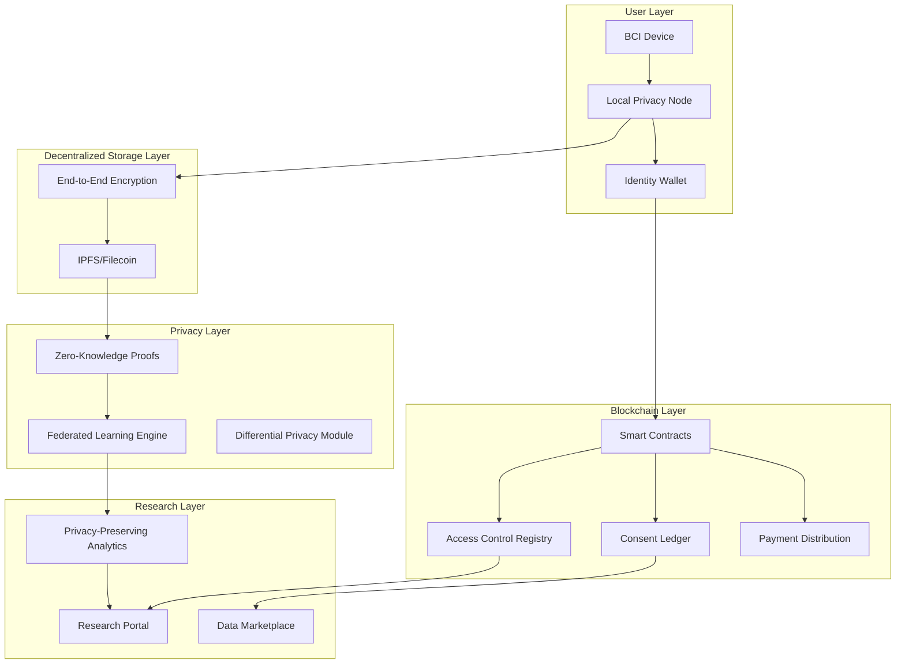

# NeuralVault - BCI Data Sovereignty Protocol

NeuralVault is a privacy-first protocol and application stack for Brain-Computer Interface (BCI) data.
It enables data owners to retain control over neural datasets while allowing researchers to discover, request, and pay for access using transparent rules.

The repository combines smart contracts, backend services, and a web app into one monorepo.

---

## Problem Statement

With companies like Neuralink and Synchron advancing clinical BCI trials, neural data privacy has become critical. Current systems store BCI data in centralized databases controlled by corporations or research institutions. 

**Key Issues:**
- Patients lack control over who accesses their neural recordings
- No transparency in how data is used
- Cannot monetize contributions to research
- Serious ethical concerns around neural data ownership and consent
- Risk of neural data breaches and unauthorized access
- No standardized consent mechanisms for neural data sharing

---

## Solution Overview

The Neural Privacy Layer creates a decentralized, privacy-preserving infrastructure that:

1. **Data Sovereignty**: Users maintain cryptographic control over their BCI data
2. **Privacy-Preserving Research**: Enable research collaboration without exposing raw neural data
3. **Consent Management**: Granular, revocable consent mechanisms
4. **Data Monetization**: Fair compensation for data contributions
5. **Interoperability**: Standard protocols for BCI data exchange
6. **Auditability**: Transparent, immutable access logs

---

## System Architecture



---

## Core Components

### 1. Local Privacy Node
An edge computing node that processes BCI data locally. It handles real-time ingestion, anonymization, and encryption before any data leaves the user's control.

### 2. Decentralized Storage (IPFS/Filecoin)
Encrypted BCI data is stored using content-addressed protocols, ensuring immutability and redundancy without relying on centralized servers.

### 3. Blockchain Layer (Smart Contracts)
- **Identity Registry**: Sovereign identity management for data owners.
- **Consent Manager**: Granular, revocable permissions for data access.
- **Payment Distributor**: Transparent escrow and automated compensation for data contributions.

### 4. Privacy-Preserving Computation
Utilizes **Zero-Knowledge Proofs (ZKP)** and **Differential Privacy** to allow researchers to verify data traits and run analytics without ever seeing the raw neural signals.

---

## User Flows

### 1. Data Owner Flow
- **Register**: Connect wallet and create a sovereign identity.
- **Upload**: Securely upload BCI datasets; data is encrypted locally and pinned to IPFS.
- **Control**: Set granular consent preferences and monitor access requests.
- **Earn**: Receive automated compensation when research requests are approved and data is accessed.

### 2. Researcher Flow
- **Discover**: Browse the marketplace for available neural datasets via metadata.
- **Request**: Submit access requests for specific data types with research proposals.
- **Negotiate**: Agree on terms and trigger the escrow-based payment flow.
- **Access**: Securely access and analyze data within the privacy-preserving framework.

---

## Monorepo Structure

- `contracts` - Solidity contracts for identity, consent, and payments
- `infra` - Node.js/TypeScript backend API and service integrations
- `web` - Next.js frontend for landing, owner, and researcher workflows
- `ignition` - Hardhat Ignition deployment module(s)
- `test` - contract tests
- `TECHNICAL_ARCHITECTURE.md` - architecture vision and system blueprint
- `NEXT_STEPS.md` - implementation status and prioritized backlog
- `pitch.md` - slide-ready pitch deck information

---

## Current Implementation Status

This repository contains a strong functional foundation and demo-ready flows.
It is **not fully production-hardened** yet.

### Implemented

#### Smart Contracts

- `contracts/IdentityRegistry.sol`
  - user registration
  - access grant/revoke by data category
  - vault CID and encryption key CID updates

- `contracts/ConsentManager.sol`
  - consent preferences by data type
  - request/approve/deny lifecycle
  - consent logs and allowed purpose retrieval

- `contracts/PaymentDistributor.sol`
  - payment agreement creation
  - escrow/release/refund lifecycle
  - platform fee configuration

Contract tests are available under `test/`.

#### Backend (`infra`)

- Express server with middleware (`helmet`, `cors`, request logging)
- Supabase integration and schema (`infra/supabase-schema.sql`)
- Pinata service for upload/download to IPFS/Filecoin
- AES-256-GCM encryption/decryption service
- Blockchain client and contract wrapper modules
- API route modules:
  - `/api/users/*`
  - `/api/data/*`
  - `/api/consent/*`
  - `/api/payments/*`

#### Frontend (`web`)

- Next.js App Router frontend
- Landing and product marketing sections
- Data owner portal for metadata + file upload flow
- Researcher marketplace UI with discovery/filtering
- Wallet connection scaffolding with Reown AppKit + Wagmi
- Local state demo utilities for selected purchase paths

### Gaps to Production

- Signature-based authentication and route protection
- Full end-to-end on-chain execution in all frontend flows
- Event-driven blockchain-to-database sync hardening
- Broader request validation and integration/E2E test coverage
- Security audit and deployment hardening

For tactical priorities, use `NEXT_STEPS.md`.

---

## Tech Stack

- **Smart Contracts**: Solidity, Hardhat 3, OpenZeppelin
- **Backend**: Node.js, TypeScript, Express, Ethers, Supabase, Pinata, Winston, Zod
- **Frontend**: Next.js 16, React 19, Wagmi, Viem, Reown AppKit
- **Storage/Database**: IPFS/Filecoin via Pinata, PostgreSQL via Supabase

---

## Prerequisites

- Node.js 18+ (Node.js 20+ recommended)
- npm
- Supabase project (URL + keys)
- Pinata credentials/JWT
- Ethereum RPC endpoint (Sepolia or compatible)
- Wallet private key for deployment transactions

---

## Local Setup

### 1) Install dependencies

From project root:

```bash
npm install
```

Install module dependencies:

```bash
cd infra && npm install
cd ../web && npm install
cd ..
```

### 2) Configure environment variables

Create:

- root `.env` (Hardhat/deployment values)
- `infra/.env` (backend service/config values)
- `web/.env.local` (frontend public config)

#### Suggested root `.env` (Hardhat)

```env
SEPOLIA_RPC_URL=
SEPOLIA_PRIVATE_KEY=
BASE_SEPOLIA_RPC_URL=
BASE_SEPOLIA_PRIVATE_KEY=
```

#### Required `infra/.env`

```env
SUPABASE_URL=
SUPABASE_ANON_KEY=
SUPABASE_SERVICE_KEY=

PINATA_API_KEY=
PINATA_SECRET_KEY=
PINATA_JWT=

ETHEREUM_RPC_URL=
IDENTITY_REGISTRY_ADDRESS=
CONSENT_MANAGER_ADDRESS=
PAYMENT_DISTRIBUTOR_ADDRESS=

ENCRYPTION_KEY=
JWT_SECRET=
PORT=3000
NODE_ENV=development
```

Notes:
- `ENCRYPTION_KEY` must be a 64-hex-character key.
- `JWT_SECRET` should be at least 32 characters.

#### `web/.env.local`

```env
NEXT_PUBLIC_PROJECT_ID=
NEXT_PUBLIC_PINATA_JWT=
NEXT_PUBLIC_PINATA_GATEWAY=
```

### 3) Initialize database schema

Run:

- `infra/supabase-schema.sql`

inside the Supabase SQL editor for your project.

### 4) Compile and test contracts

```bash
npx hardhat compile
npx hardhat test
```

### 5) Deploy contracts (example: Sepolia)

```bash
npx hardhat ignition deploy ignition/modules/NeuralPrivacy.ts --network sepolia
```

After deployment, set the resulting addresses in `infra/.env`.

---

## Running the Apps

### Backend

```bash
cd infra
npm run dev
```

### Frontend

Run in a separate terminal:

```bash
cd web
npm run dev
```

If both default to port 3000, adjust one environment configuration.

---

## API Overview

Primary endpoints:

- `GET /health`
- `GET /api`
- `POST /api/users/register`
- `GET /api/users/:walletAddress`
- `POST /api/data/upload`
- `GET /api/data/:userId`
- `GET /api/data/record/:id`
- `GET /api/data/download/:cid`
- `DELETE /api/data/:id`
- `POST /api/consent/preferences`
- `GET /api/consent/preferences/:walletAddress/:dataType`
- `POST /api/consent/request`
- `POST /api/consent/approve`
- `POST /api/consent/deny`
- `GET /api/consent/logs/:walletAddress`
- `POST /api/payments/agreement`
- `GET /api/payments/agreement/:dataOwner/:researcher/:agreementId`
- `GET /api/payments/agreements/:walletAddress`
- `POST /api/payments/escrow`
- `POST /api/payments/release`
- `POST /api/payments/refund`

---

## Demo Walkthrough

1. Open the web app landing page.
2. Use owner portal to upload dataset + metadata.
3. Verify data appears in researcher marketplace.
4. Perform request/purchase demo flow.
5. Inspect backend records and consent/payment states via APIs.

---

## Security Notes

- Data encryption uses AES-256-GCM in backend flow.
- Contract logic enforces access and payment lifecycle rules.
- This project is currently in active development; run security review/audit before production deployment.

---

## Development Priorities

1. Implement robust wallet-signature authentication middleware.
2. Complete full on-chain write execution for frontend transaction flows.
3. Add strict request schema validation for all write endpoints.
4. Increase integration and E2E testing coverage.
5. Add contract event listener synchronization into backend persistence layer.
6. Standardize `.env.example` files in root, `infra`, and `web`.

---

## Related Documents

- `TECHNICAL_ARCHITECTURE.md` - long-form architecture proposal
- `NEXT_STEPS.md` - implementation analysis and TODO priority order
- `BACKEND_ALTERNATIVES.md` - backend stack options and tradeoffs
- `pitch.md` - deck-ready pitch content

---

## License

MIT (unless replaced by project maintainers).
